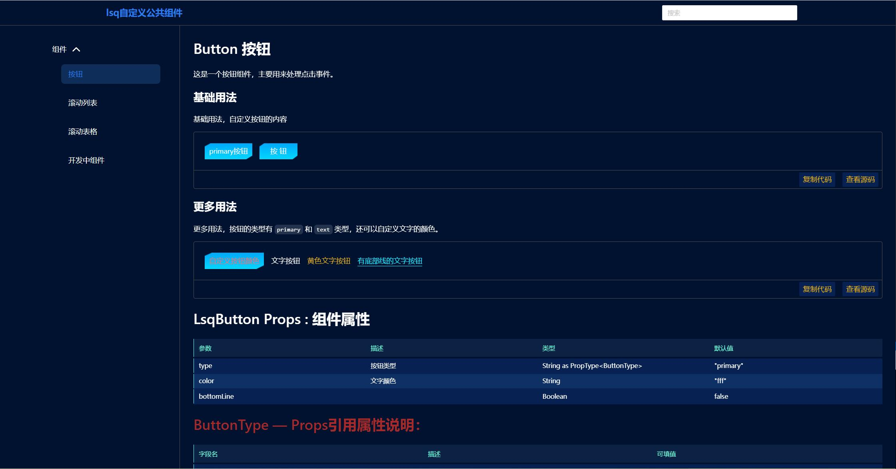

# Vue3 + vite + ts

从 0 到 1 开发一个自定义的 ui 库，并实现按需引入和完整引入 2 种引入模式。

目录结构：

```
| /config -配置文件
| /package - 组件开发
| /script - 脚本
| /src -组件测试
|- /doc -文档项目的框架
|- /test -存放对应的测试组件,目录name必须与组件对应,
| README.MD 说明文档
```

---

## 如果想要使用自动生成组件的文档说明，则需要遵循一些开发规则



### 组件库 packages/\* 命名规范

1. 组件文件夹 - 名称必须以 lsq-\* 格式命名;
2. 组件文件 - 命名必须以 LsqTest 格式名称;
3. 组件文件夹内的文件有：【LsqTest.tsx】【definition.ts】【index.ts】【index.scss】4 个文件;

### 组件编写规范

1. 组件 props/emits 必须单独声明变量, props/emits 命名必须是 lsqTestProps/lsqTestEmits 格式,API 只有规范命名才会生成对应的 API 文档。
2. 组件的每一个 prop/emit 都必须添加符合 JSDoc 标准的块级注释, 以便生成 API 文档时可以生成对应的 API 说明;
3. props 所引用得类型说明需要在 index.ts 定义，然后再引用。

### LsqTest.tsx

```tsx
import { h, defineComponent, PropType } from 'vue';

const lsqTestProps = {
  /** 测试名称*/
  name: String as PropType<string>,
  /** 测试年龄*/
  age: Number as PropType<number>,
};

const lsqTestEmits = {
  /** 更新触发 */
  'update:show': (payload: any) => {
    return true;
  },
  /** 点击触发 */
  onClick: (payload: Event) => {
    return true;
  },
};

export default defineComponent({
  props: lsqTestProps,
  emits: lsqTestEmits,
  setup(props, { emit, slots }) {
    return () => <div>test</div>;
  },
});
```

### definition.ts

```ts
import { definition } from '../commonTypes';
let _definition: definition = {
  name: 'lsq-test',
  zhName: '组件中文名',
  state: '组件状态', // 'offline'下线 | 'doing'开发中 | 'finish'已完成；只有已完成的才会在文档中出现
  order: Number, // 排序，文档中左侧组件菜单出线得顺序
};
export default _definition;
```

---

## 开发调试

- 启动调试

```shell
npm run dev
```

- 新增组件

```
npm run createCom
```

- 更新说明文档

```shell
npm run build:code
```

- 构建文档

```shell
npm run build:doc
```

## 代码发布

```shell
npm run build:lib
npm publish

```

---

- 引用组件（main.js）

```js
/* 按需引入 */
import { LsqButton } from 'standard-vue-cockpit-ui';
import 'standard-vue-cockpit-ui/lib/style.css';
const app = createApp(App);
app.use(LsqButton);

/* 完整引入 */
import componentsAll from 'standard-vue-cockpit-ui';
import 'standard-vue-cockpit-ui/lib/style.css';
const app = createApp(App);
app.use(componentsAll);
```
